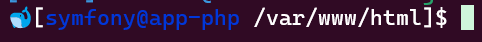

# Mise à jour de l'environnement

Cette option mettra à jour votre environnement averc vos modifications du fichier `.env.docker`

## Conteneur PHP

Se connecter dans le conteneur PHP :
`docker compose exec php sh`

Un petit smiley de baleine vous permettra de savoir si vous êtes dans le conteneur.

### Accès aux sites :

- Votre projet Symfony : http://localhost:8080
- PHPMyadmin : http://localhost:9080
- Mailpit : http://localhost:8025

Les ports seront ceux que vous aurez choisis dans votre fichier `.env.docker`.
