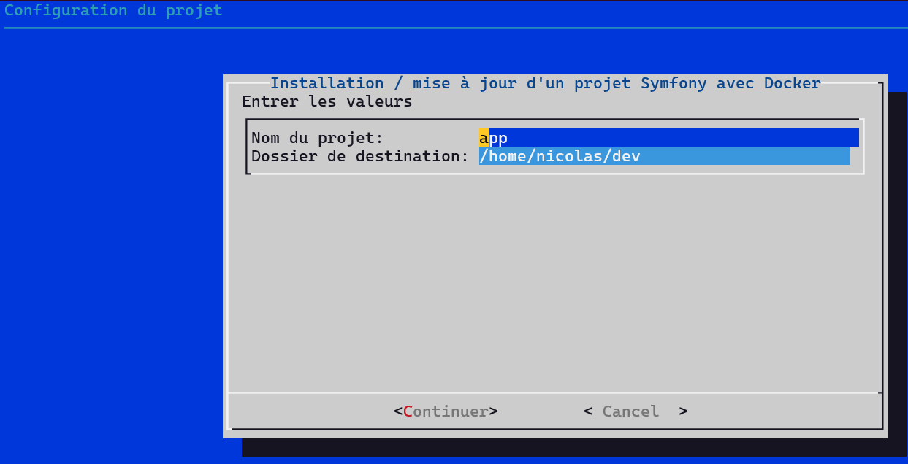
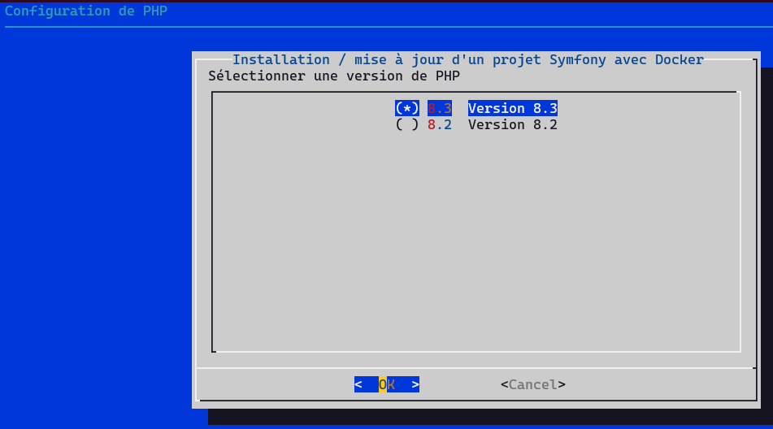
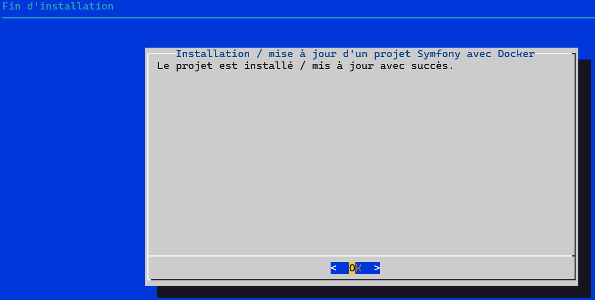

# Environnement seul

Cette option installera :

- PHP
- Apache
- MariaDB
- Mailpit
- PHPMyAdmin
- NodeJS

## Configuration du projet

Le nom du projet doit être sans caractères spécials, sans espace et en minuscule.

Le dossier de destination doit exister.

Le dossier destination contiendra un dossier avec le nom du projet. Votre projet sera dans ce répertoire.

## Configuration de la base de données

La base de données est MariaDB.

## Configuration de PHP

Vous avez le choix de 3 versions

## Configuration de Node

Vous avez le choix de 2 versions

## Configuration du réseau

La configuration des ports de votre hôte pour accéder à vos conteneurs

---

- Les images seront créés et téléchargés
- containers seront lancés automatiquement (docker compose up -d)

## Vérification des conteneurs lancés

- `docker ps --format '{{.Names}}'`
- Vous devriez avoir 6 conteneurs préfixés par le nom de projet choisi.

## Répertoire d'installation

Le répertoire d'installation est `le répertoire de destination` + `nom du projet`.

Le répertoire de destination par défaut : `répertoire home de votre utisateur\dev`
Le nom du projet par défaut : `app`

Dans votre répertoire d'installation, vous devriez avoir :

- un fichier `.env.docker`
- un fichier `.gitignore`
- un fichier `compose.yaml`
- un répertoire `public` vide.

---

## Conteneur PHP

Se connecter dans le conteneur PHP :
`docker compose exec php sh`

Un petit smiley de baleine vous permettra de savoir si vous êtes dans le conteneur.

Installer Symfony dans un répertoire temporaire : `composer create-project symfony/skeleton:"7.0.*" /tmp/tmp-project`

A la fin de l'installation, il faudra refuser la configuration Docker pour la base de données en tapant `n`

Déplacer le projet pour persister votre code
`rsync --archive --remove-source-files --update --compress "/tmp/tmp-project/" /var/www/html/`

Supprimer le répertoire temporaire
`rm -fr /tmp/tmp-project`

### Accès aux sites :

- Votre projet Symfony : http://localhost:8080
- PHPMyadmin : http://localhost:9080
- Mailpit : http://localhost:8025

Les ports seront ceux que vous aurez choisis. Ils sont présents dans votre `.env.docker`.
