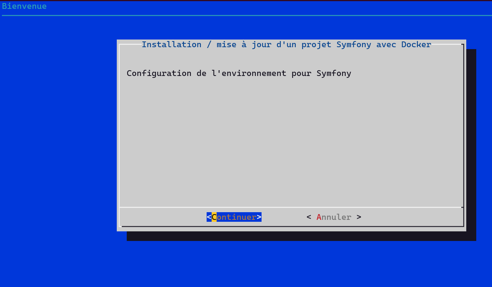
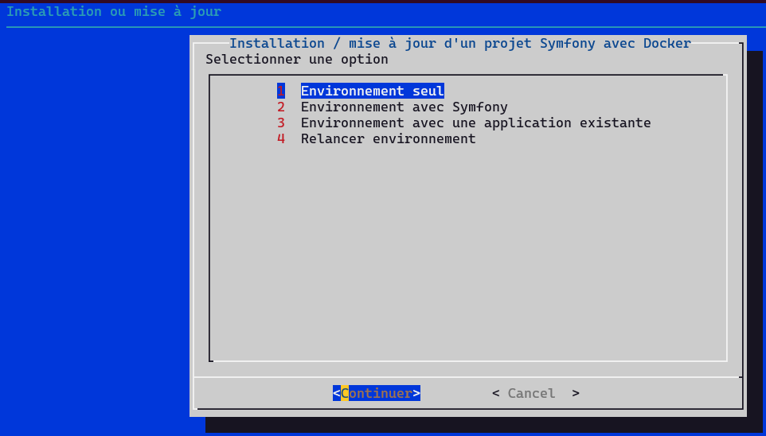

# Installation de l'environnement pour Symfony

Un script vous permet d'installer cet environnement :

```bash
bash <(curl -sSL https://raw.githubusercontent.com/NicoDevelopp/docker/main/install.sh)
```



Ce script vous offre 4 choix d'installation :

- [Environnement seul](environnement_seul.md)
- [Environnement avec Symfony](environnement_symfony.md)
- [Environnement avec une application existante](environnement_application.md)
- [Relancer l'environnement Docker](environnement_reboot.md)


